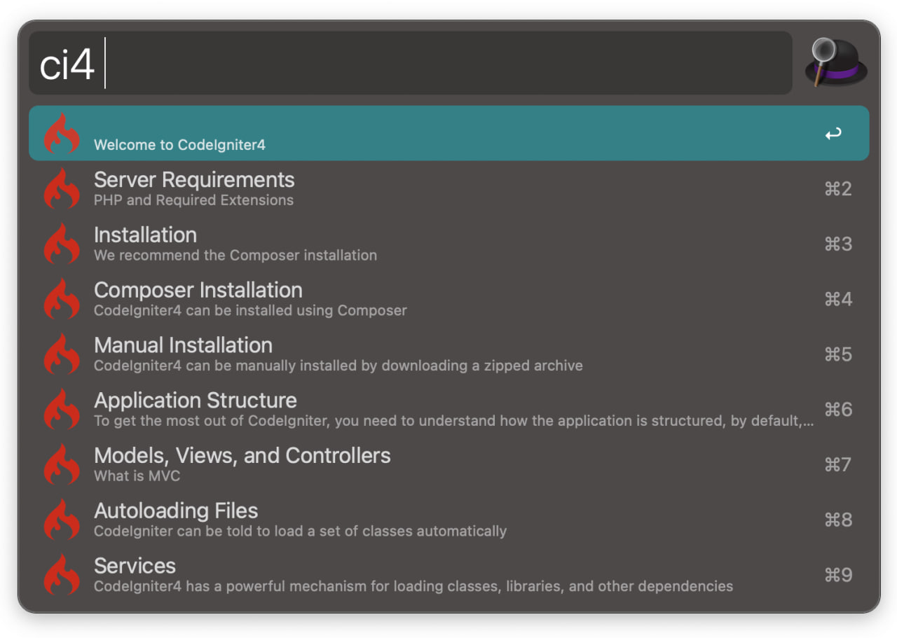

# CodeIgniter4 Docs Workflow for Alfred

An ultra-fast CodeIgniter4 docs search workflow for [Alfred 3+](https://www.alfredapp.com).



## Installation

1. [Download the latest version](https://github.com/wpdew-com/alfred-codeignier-docs)
2. Install the workflow by double-clicking the `.alfredworkflow` file
3. You can add the workflow to a category, then click "Import" to finish importing. You'll now see the workflow listed in the left sidebar of your Workflows preferences pane.

## Usage

Just type `ci4` followed by your search query.

```
ci4 <query>
ci4 Installation
```

Either press `⌘Y` to Quick Look the result, or press `<enter>` to open it in your web browser.

## Changing Branches

By default this workflow searches the `master` branch of the docs. However, you can change that to any branch listed on https://codeigniter.com/user_guide/.
